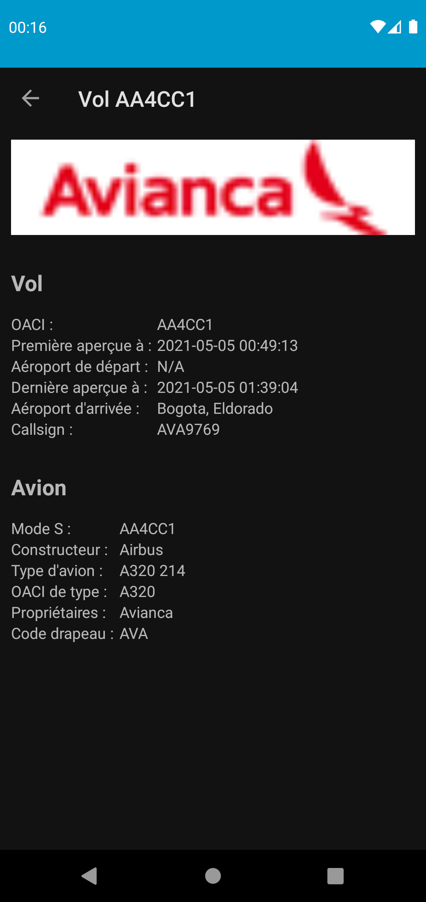

# FlyList
List today's flights

## Features
- List flights happening in the world in real time (almost)
- Choose between 4 list views
- Customizable and saved settings & filters
- Dynamic layouts
- Localized interface
- Light & Dark mode support
- Support from Android M (6.0) to latest

## Notes
APK available [here](app/build/outputs/apk/debug/app-debug.apk). ICAO Airports list for in-app airport filter available [here](https://en.wikipedia.org/wiki/ICAO_airport_code).

## Future improvements
- Add cache for main list
- Support device rotation
- Improve error messages
- Add in-app info for airports codes
- Load detail page asynchronously and switch to MVVM for it
- Add floating button in details page for a reservation

## Screenshots

    <figure>
        
        <figcaption>Main screen of the app</figcaption>
    </figure>
    <figure>
        
        <figcaption>Detail screen of the app</figcaption>
    </figure>
    <figure>
        
        <figcaption>Demo of the filter feature</figcaption>
    </figure>

> Antoine LETHIMONNIER - ESIEA 3A UFA - 2021
